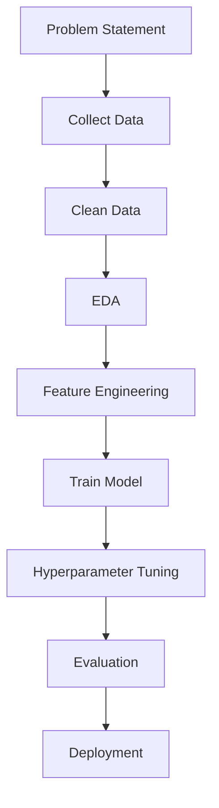

<div align="center">


<br>

# 🤖 Machine Learning Portfolio

### Building Intelligent Systems with Data, Mathematics & Machine Learning

<p align="center">

</p>

<p>

<a href="https://github.com/ksahu-298">

</a>

<a href="mailto:karansahu.engineer@gmail.com">

</a>

<a href="https://linkedin.com/in/k-sahu">

</a>

<a href="https://drive.google.com/file/d/1U7I91pVMTebf0cy1etgCK79TKcBW0Zss/view?usp=sharing">

</a>

</p>


</div>

---

# 📖 About This Repository

Welcome to my **Machine Learning Portfolio**.

This repository contains a curated collection of **end-to-end Machine Learning projects** built to solve real-world problems using modern data science and machine learning techniques.

Each project follows an industry-standard workflow:

```
Problem Statement
        ↓
Data Collection
        ↓
Data Cleaning
        ↓
Exploratory Data Analysis
        ↓
Feature Engineering
        ↓
Model Building
        ↓
Hyperparameter Tuning
        ↓
Evaluation
        ↓
Deployment
```

---

# 🚀 Repository Goals

✅ Learn Machine Learning from fundamentals

✅ Build production-ready ML projects

✅ Improve Python & Data Science skills

✅ Practice model deployment

✅ Build a strong AI portfolio

---

# 📂 Repository Structure

```
Machine-Learning-Portfolio/

│

├── Regression/

├── Classification/

├── Clustering/

├── Recommendation Systems/

├── NLP/

├── Computer Vision/

├── Time Series/

├── Ensemble Learning/

├── Feature Engineering/

├── Model Deployment/

└── Utilities/
```

---

# 🛠 Tech Stack

## Programming


---

## Machine Learning


---

## Data Science


---

## Backend


---

## Database


---

## Tools


---

# 📊 Machine Learning Workflow



---

# 📁 Featured Projects

| Project | Status | Description |
|----------|--------|-------------|
| 🏡 House Price Prediction | Coming Soon | Regression |
| ❤️ Heart Disease Prediction | Coming Soon | Classification |
| 💳 Credit Card Fraud Detection | Coming Soon | Anomaly Detection |
| 📧 Spam Email Detection | Coming Soon | NLP |
| 🎬 Movie Recommendation System | Coming Soon | Recommendation |
| 📈 Stock Price Prediction | Coming Soon | Time Series |

---

# 📚 Topics Covered

- Supervised Learning

- Unsupervised Learning

- Regression

- Classification

- Clustering

- Dimensionality Reduction

- Feature Engineering

- Ensemble Learning

- Hyperparameter Tuning

- Cross Validation

- Model Evaluation

- Explainable AI

- Model Deployment

---

# 🎯 Learning Roadmap

```text
✅ Python

✅ NumPy

✅ Pandas

✅ Statistics

🟨 Machine Learning

⬜ Deep Learning

⬜ NLP

⬜ Computer Vision

⬜ Reinforcement Learning

⬜ LLMs

⬜ AI Agents

⬜ MLOps
```

---

# 📈 Repository Statistics

> GitHub automatically displays:

⭐ Stars

🍴 Forks

👀 Watchers

📂 Files

📜 Commit History

---

# 🤝 Contributions

Suggestions, ideas and improvements are always welcome.

Feel free to fork the repository and create a Pull Request.

---

# 📫 Connect With Me

<div align="center">

<a href="mailto:karansahu.engineer@gmail.com">


</a>

<a href="https://linkedin.com/in/k-sahu">


</a>

<a href="https://drive.google.com/file/d/1U7I91pVMTebf0cy1etgCK79TKcBW0Zss/view?usp=sharing">


</a>

</div>

---

<div align="center">

## ⭐ If you found this repository useful, don't forget to star it!

### Built with ❤️ by **Karan Sahu**

*"Learning. Building. Improving. Every Single Day."*

</div>
